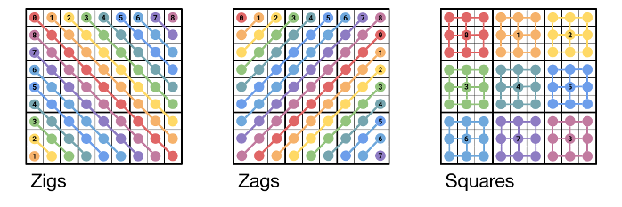

# ZigZag

## Problem

We have updated the inputs and outputs of the first coding challenge (ZigZag). Please download the full input file again to have the updated version.
ZigZag is a logic-based, combinatorial number-placement puzzle, similar to Sudoku. The objective is to fill a 9x9 grid so that each zig, zag and square contain all the digits from 0 to 8, inclusive, exactly once.
Zigs are diagonals, running from top left to bottom-right and wrapping around. Zags are diagonals, running from top-right to bottom-left (orthogonal to the zigs) and squares are 3x3 sub-grids, similar to Sudoku.
The following diagrams indicate which Zigs, Zags and Squares each cell in a ZigZag belongs to. In the Zigs diagram (left), all the cells in a Zig share a color and are connected by lines to a cell with the Zig's numeric label. The Zags and Squares diagrams are organised similarly:



Note that Zigs and Zags wrap around the grid, so each label appears twice in these diagrams.
Given a list of unfinished ZigZags, provide the sum of the values of their top-left cells. Note that for every ZigZag grid in the input, it's guaranteed that the value of its top-left cell can be deduced by looking at just the cells in Zig 0, Zag 0, and Square 0.

## Input

The input file format is as follows:
The first line contains a single integer N, indicating the number of grids to follow.
Each grid is printed with each of its rows on its own line.
The "." character indicates an empty cell.
Grids are separated from each other with an empty line.

## Output

Your output should be a file containing a single line with a number that's the sum of the values of the top-left cells of all grids, after the puzzles have been solved.

## Constraints

1 ≤ N ≤ 10,000

## Explanation of Sample

There are 3 puzzles in the sample. After solving all of them, the sum of the top left cells of all three of them is 1 + 8 + 4 = 13

Sample Input

```text
3
. 4 . . . . . 2 8
3 . . . 7 . 3 5 6
5 . 7 . . . . . .
. . 5 . 1 3 5 . .
. 4 . . 2 8 . . .
. 8 . 4 . . 2 . 3
4 5 . 2 7 4 . 5 2
. 6 3 0 . 1 . 0 .
. 7 . 6 . . . . .

. . . 0 . . 2 5 .
. 0 . 4 . . 3 8 .
1 4 7 . . . . . 1
. . 0 6 . 2 2 . 4
5 6 3 . 3 . . 7 5
. . . 0 . . 8 . .
4 . . 5 . . 2 3 8
0 . . . 3 . . . 0
. 7 8 6 . 0 . . 1

. . . . . 0 4 . 0
. . . . . 3 8 2 3
2 . 1 . . . . . 1
7 . . . 6 . 7 . .
3 5 6 . 5 2 3 . .
4 . 0 . . 0 . . 0
2 . . 8 . 7 6 5 .
. . . . 3 . 4 . .
1 . 8 . 2 6 1 8 .
```

Sample Output

```text
13
```
