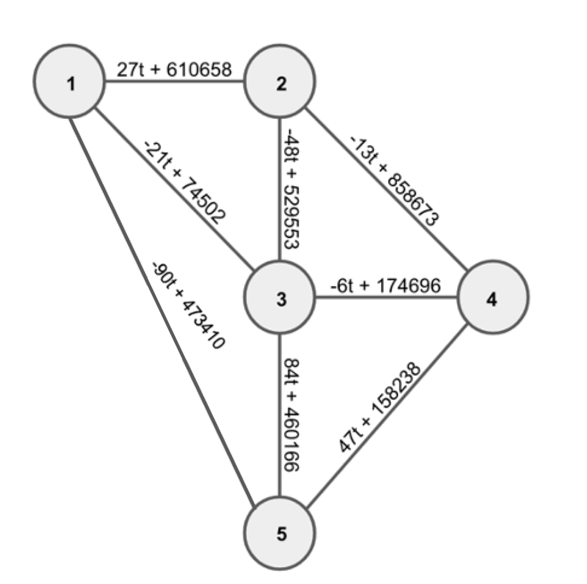

# Commercial Operations

## Problem

The Fantastic Bureau of Hilarious Algorithms and Cautious Kaizen (FB HACK) is paid for handling transactions between offices distributed through-out the world.

Offices are connected in a network that transactions are routed through. Edges in the network are not directed (transactions can flow in both directions) and are weighted with the cost of using that edge in the transaction. Customers pay FB HACK the cost along the minimal path for handling their transaction.

However, timing is everything: The cost on each edge in the graph changes as a linear function of time, i.e. the cost of sending a transaction between offices i and j that are connected by an edge in the network is:

A_{ij}t+B_{ij}

at time t and FB HACK is allowed to schedule customers' transactions at its own discretion. You work for FB HACK, and your job is to schedule transactions to maximize FB HACK's profit by scheduling transactions at the times when customers would pay most for them.

Note: at no time does any edge have a negative cost

## Constraints

A hotly anticipated feature has finally arrived to FB Hack's transaction network: high-frequency trading! This means that a transaction can happen at any fraction of a second, and the fee may no longer be a whole number.

- 1 ≤ N ≤ 1000
- 1 ≤ M ≤ 10000
- 0 ≤ t ≤ 24 * 60, and t is a real number
- For all 0 ≤ k < M
  - 1 ≤ Ik < Jk ≤ N
  - -100 ≤ Ak ≤ 100
  - 0 ≤ Bk ≤ 1000000
  - 0 ≤ Ak t+Bk

## Input

Your input starts with two integers: N and M, the number of offices and edges respectively. Offices are numbered sequentially from 1 to N with 1 being the source office of the transaction and N being the destination office. M lines follow, describing edges in the network with the kth such line consisting of four integers:

Ik Jk Ak Bk

describing an edge between office Ik and Jk with cost Ak t+Bk at time t.

There is at most one connection between each pair of FB HACK offices, and there is at least one path between the source FB HACK office and the destination FB HACK office.

## Output

Output a rational number, with exactly five decimal points of precision (no more, no less), padding or rounding as necessary, representing the maximum total fee that FB HACK can collect within the time range.

## Explanation of Sample



At t = 599.7636365 the minimum cost is 419431.27273 which is the cost of the transactions going through the path 1->3->4->5. This is the maximum we could get throughout the day

Sample Input

```text
5 8
1 2 27 610658
2 3 -48 529553
3 4 -6 174696
4 5 47 158238
3 5 84 460166
1 3 -21 74502
2 4 -13 858673
1 5 -90 473410
```

Sample Output

```text
419431.27273
```
