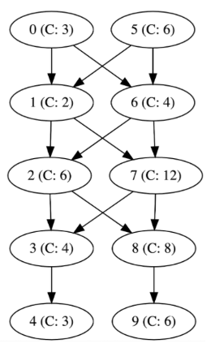

# CI Pipelines

## Problem

At Meta, we have a system in place called "Continuous Push". This means that we have a pipeline of servers that take revisions of our code, check them, build them, and then push them out into production 24/7. Each server has a capacity that tells us how many revisions an hour it will be able to process. We want to find out how often a version can be pushed into production in the ideal case.

Our Continuous Push process requires a series of N subsequent stages that perform specific actions on each revision of the code (build, test, etc). We have dedicated servers for each stage of the process, each one able to process C revisions over the course of an hour. Each server then passes it on to another one in the pipeline that is able to perform the action corresponding to the following stage.

Initially, we have servers labeled from 0 to N-1, arranged in multiple pipelines. One server can receive inputs from multiple other servers and can pass off its output to a range of servers yet again. We hope that this will remove bottlenecks from our system and speed up deployment.

Servers with multiple output destinations can choose which server to pass their results to. They are free to divide their output in any ratio among their downstream servers in order to maximize throughput.

Given a list of servers with their capacities and inputs/output destinations, we'd like to know the throughput of our pipeline (how many revisions an hour make it to production) once the system is "hot", i.e. at maximum capacity.

## Input Format

The first part of input will be the number of stages N.
The second part is a list of the capacity of each server C(0... N-1). Since there are N stages/servers, there will be N lines.
The third part is a list of dependencies in the form of (a b), meaning that Server a will pass its result onto Server b.
The parts are separated by a new line.

## Constraints

- 0 < N < 1500
- 0 < C < 10000

## Explanation of Sample

Server 5 can divide up its capacity and send 2 revisions to Server 1 and 4 revisions to Server 6. But now, the second stage (Server 1 and 6) are at full capacity and cannot process any more revision from Server 0. The remaining stages can process more than 6 revisions so the second stage is the bottleneck which has a capacity of 6.



Sample Input

```text
10

3
2
6
4
3
6
4
12
8
6

0 1
0 6
1 2
1 7
2 3
2 8
3 4
5 6
5 1
6 7
6 2
7 8
7 3
8 9
```

Sample Output

```text
6
```
